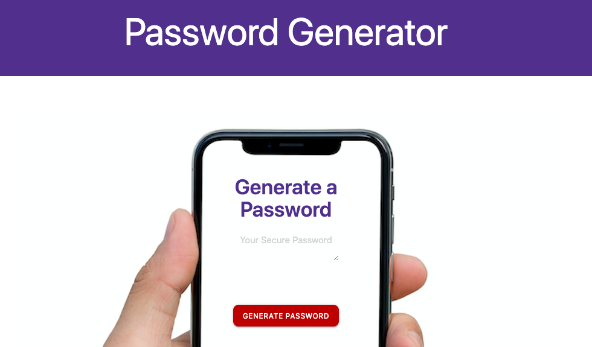

# Password Generator

## Description

This application, written in javascript, is producing a password based on user's specifications.
The user is promped to select the length of the password, character types to include (lowercase, uppercase, symbols and digits).
Based on user's input, a password is generated on the screen.

### URL: https://hcs847.github.io/pass-generator/

